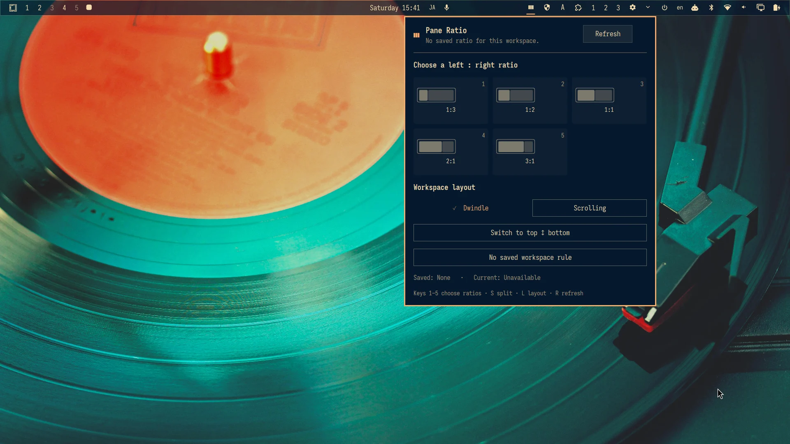

# Pane Ratio

[English](README.md) | 简体中文 | [日本語](README.ja.md)

Pane Ratio 是一款 Omarchy 状态栏插件：它可以为每个工作区选择 Dwindle 或 Scrolling 布局，记住左右窗口比例，并在 Dwindle 具备安全调整条件时自动应用该比例。



## 功能

- 在紧凑的状态栏面板中提供 `1:3`、`1:2`、`1:1`、`2:1` 和 `3:1` 比例预设。
- 将当前工作区显式切换为 Dwindle 或 Scrolling，并把选择保存到 Omarchy 原生的工作区布局状态中。
- 即使工作区只有零个或一个平铺窗口，也会保存所选比例。
- 第二个平铺窗口出现时，自动应用已保存的比例。
- 出现三个或更多平铺窗口时暂停调整且不改变窗口几何；恢复为两个窗口后继续工作。
- 在安全的双窗格（两个平铺窗口）Dwindle 场景中切换左右或上下分割，不重排更大的窗口树。
- 识别并高亮当前比例预设；手工调整到非预设比例后显示 `Custom`。
- 忽略浮动窗口。
- 遇到含糊的布局时拒绝猜测。
- 按工作区保存的比例意图存放在 `~/.local/state/omarchy-pane-ratio/`；插件不会修改 Hyprland 配置。

自动应用有意限定为 Dwindle 工作区中恰好两个、横向排列、未分组且非全屏的窗口。Scrolling 与多层 Dwindle 窗口树需要不同语义，插件不会在后台近似处理它们。

## 安装

```bash
omarchy plugin add https://github.com/r404r/omarchy-pane-ratio.git --enable
```

无需运行 setup 脚本，也无需重新加载 Hyprland。后端直接从已安装的插件目录运行。

## 卸载

```bash
omarchy plugin remove io.github.r404r.pane-ratio
```

卸载不需要 `sudo`，也不会遗留 Hyprland 快捷键或 setup 配置块。已保存的比例意图和 Omarchy 的工作区布局选择会作为用户状态保留。只有在也想丢弃已保存比例时，才需要手工删除 `~/.local/state/omarchy-pane-ratio/`。

## 使用

点击 Pane Ratio 图标，然后选择比例预设。规则属于当前工作区，也可以在第二个窗口出现前提前选择。

面板内的键盘操作：

- `1`–`9`：选择对应位置的预设（默认列表使用 `1`–`5`）
- `D`：忘记当前工作区规则
- `S`：在左右和上下双窗口分割之间切换
- `L`：在 Dwindle 和 Scrolling 工作区布局之间切换
- `R`：刷新
- 方向键和 Enter：导航并应用
- Escape：关闭

`Waiting` 表示比例意图已保存，正在等待第二个平铺窗口。`Paused` 表示规则仍然保留，只是当前窗口拓扑结构不适合安全调整。插件绝不会通过近似方式修改三窗口树。

Dwindle 与 Scrolling 按钮对应 Omarchy 的 `Super+L` 工作区布局选择，但它们会明确显示目标，而不是盲目反转。选择会写入 `~/.local/state/omarchy/workspace-layouts/`，Omarchy 启动时也会从这里恢复布局。在 Scrolling 中，已保存的比例会暂停；工作区回到 Dwindle 且形成安全的双窗口拓扑后，比例会继续生效。

分割按钮对应 Omarchy 的 `Super+J`“切换窗口分割”，但插件有意将其限制在更安全的双窗口场景。切换为上下分割时会暂停已保存的左右比例；切回左右后会自动重新应用。工作区布局与 Dwindle 分割方向是两项独立控制。

## 自定义预设

无需修改插件即可替换五个默认比例。创建
`~/.config/omarchy-pane-ratio/presets.json`：

```json
{
  "schemaVersion": 1,
  "presets": ["1:3", "1:2", "1:1", "5:3", "2:1", "3:1"]
}
```

可以配置一至九个比例，每一侧必须是 1 到 20 之间的整数。比例会约分为规范形式；如果该比例已经保存，请写 `1:1`，不要写 `2:2`。修改文件后关闭并重新打开面板；事件服务会在下一次协调时重新读取配置。从预设文件中删除的已保存比例仍会保留，但会暂停，直到该预设恢复或规则被忘记。

## 安全模型

- 比例参数来自固定允许列表；拒绝任意命令和任意 Lua。
- 比例状态与 Omarchy 兼容的工作区布局规则都有大小上限、允许列表，并可抵御符号链接攻击；使用私有权限（目录 `0700`、文件 `0600`）并以原子方式替换。
- 以带超时和 schema 检查的有界 JSON 解析 `hyprctl` 输出。
- 应用前会两次检查工作区、窗口地址、焦点和布局。
- 调度前，原子 Lua guard 会再次检查窗口集合、焦点、Dwindle 布局、split bias、窗口组、全屏状态和横向几何。Hyprland 的 Lua 窗口 API 不公开 Pseudotile，因此插件不会将它作为独立策略标志，而是对其应用相同的几何条件。
- 操作后会读回并验证窗口几何。
- 轻量 Omarchy QML 服务以 `140 ms` 防抖响应相关 Hyprland 事件；没有轮询、特权命令、网络访问或用户配置写入。

## 开发

```bash
python -m unittest discover -s tests -v
omarchy plugin validate .
qmllint -I "$OMARCHY_PATH/shell" BarWidget.qml Panel.qml PaneRatioService.qml
```

## 许可证

MIT
